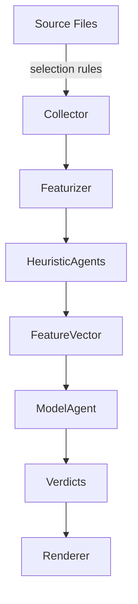

# Agent Architecture

This project treats every automated capability as an agent with a clear contract. Agents encapsulate detectors, analyzers, or orchestration helpers so that the CLI, notebooks, and future services can compose them predictably.

## Agent Taxonomy

- **Heuristic agents** wrap deterministic rules such as whitespace density, identifier entropy, and comment coverage. They emit scored features plus optional rationale.
- **Model agents** adapt statistical predictors (for example logistic regression or random forest) into a common `predict()` signature that accepts feature matrices and returns probability distributions.
- **Pipeline agents** coordinate preprocessing, feature extraction, model scoring, and explanation rendering. The `Predictor` class in `src/detector/inference.py` is the reference implementation.
- **Interface agents** expose agent pipelines to different surfaces such as the Typer CLI, React dashboard, or future REST APIs.

## Interaction Model

- The **collector** agent expands include/exclude globs and yields file descriptors.
- The **featurizer** agent transforms AST and token streams into structured metrics.
- Heuristic and model agents share an event bus (`AgentTelemetry`) so the UI can surface per-feature explanations.
- The **renderer** agent formats the final verdicts for CLI or UI consumption.

## Customizing Agents

1. Create a subclass of `BaseAgent` (or mirror the mixin pattern from existing heuristics) and document the expected input/output payload.
2. Register the agent in `src/detector/inference.py` by adding it to the `AGENT_REGISTRY`.
3. Wire configuration toggles into `src/detector/cli.py` and, if relevant, `frontend/src/types.ts`.
4. Add targeted tests in `tests/` that exercise both success and failure paths.
5. Update `docs/03-development/configuration-management.md` with any new environment variables or CLI options.

## Extensibility Guidelines

- Prefer composing agents via dependency injection to keep them testable.
- Emit structured telemetry dictionaries instead of free-form strings so the frontend can visualize them.
- Keep agent state idempotent; agents should be safe to reuse across multiple prediction runs.
- Version agents explicitly (for example `heuristic_v1`, `heuristic_v2`) to avoid silent behaviour changes in existing pipelines.

By following these conventions, contributors can safely add new heuristics, models, or UI integrations without breaking the orchestration flow.
