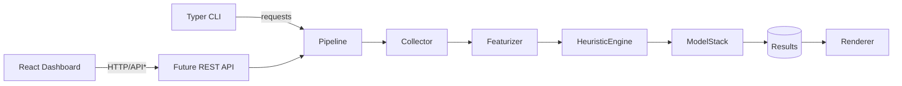

# System Architecture

## High-Level Overview

\*The dashboard currently runs entirely client-side but is designed to point to a REST API when available.

## Components

- **Collector:** Handles file discovery, inclusion/exclusion patterns, and batching.
- **Featurizer:** Parses source code into AST-derived statistics and stylistic metrics.
- **Heuristic Engine:** Applies rule-based scorers that produce interpretable signals.
- **Model Stack:** Combines calibrated ML models; optional ensembles for robustness.
- **Renderer:** Formats outputs for CLI, JSON reports, or UI consumption.
- **Verdict Store:** Transient result container; future releases may persist to a database.

## Data Flow

1. User invokes CLI or UI, specifying target files.
2. Collector streams files to featurizer.
3. Features are passed to heuristics and ML models.
4. Results are aggregated into verdict objects with explanations.
5. Renderer outputs to selected channel (console, JSON, UI state).

## Cross-Cutting Concerns

- **Logging:** Structured logs with run identifiers; optional JSON output for observability tools.
- **Telemetry:** Heuristic contributions emitted for use in dashboards.
- **Configuration:** Managed via CLI flags and environment variables documented in `docs/03-development/configuration-management.md`.
- **Security:** Offline-by-default processing; no network calls during detection unless explicitly enabled.
